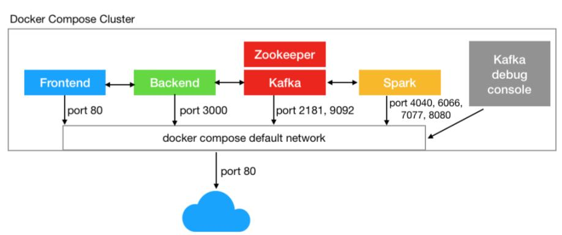
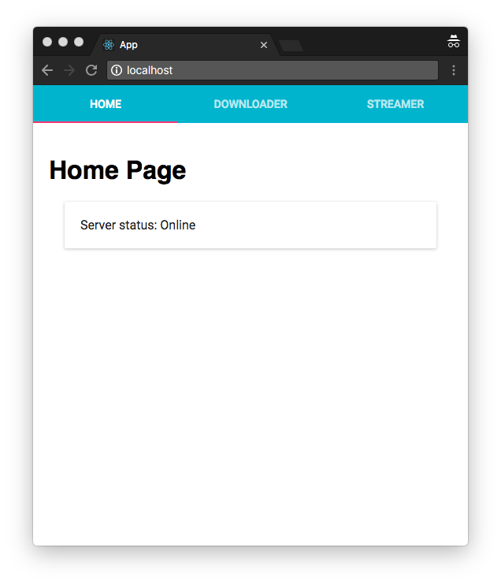
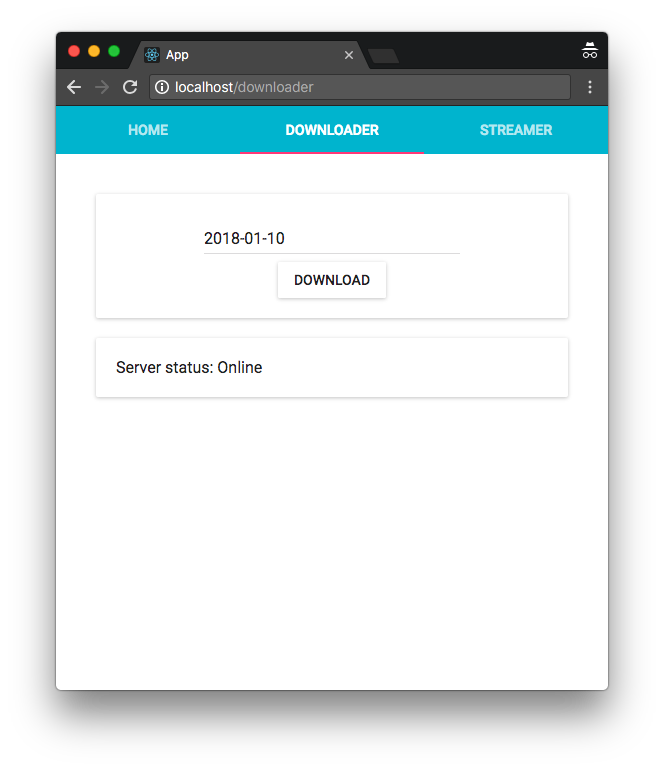
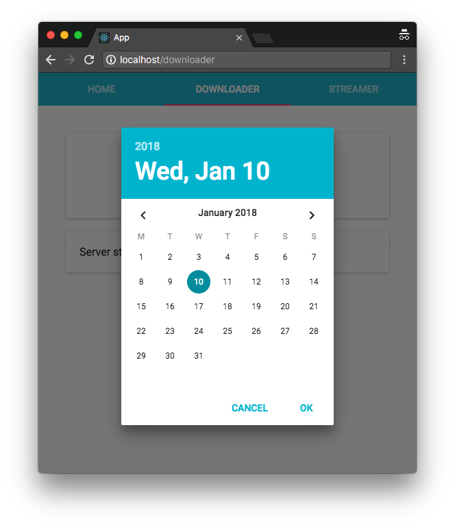
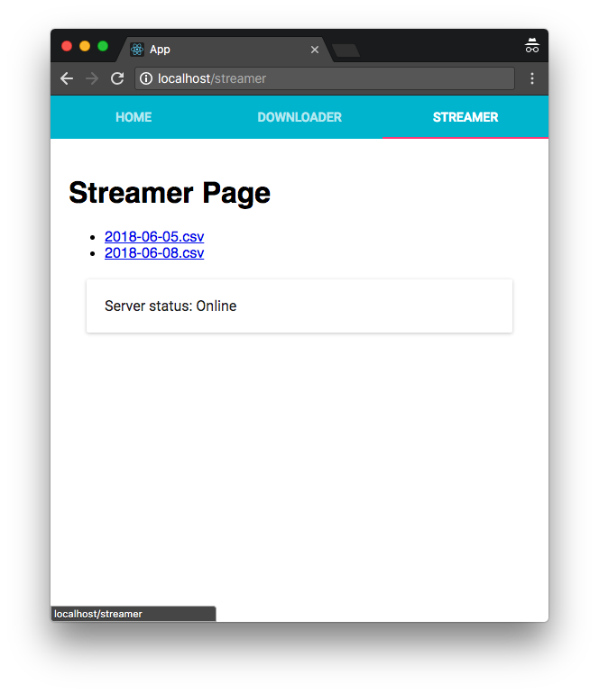

ENGR 440 - Report of Distributed Streaming Project
===

Author: [Zoltan Debre](http://zoltan.nz) (300360191) - [Victoria University of Wellington](https://www.victoria.ac.nz/), New Zealand

**Original repository:**
* https://github.com/zoltan-nz/kafka-spark-project

**Latest version of this document (Markdown):**
* https://github.com/zoltan-nz/kafka-spark-project/blob/master/docs/final-report.md

**Latest version of this document (PDF):**
* https://github.com/zoltan-nz/kafka-spark-project/blob/master/docs/final-report.pdf

# Abstract

The main goal of this project is to build a basic environment for streaming data from one or more source, pipe through via a stream management platform which can be accessed by different consumer.

Our distributed streaming platform is [Apache Kafka](https://kafka.apache.org/), the main consumer of the streaming data is an [Apache Spark](https://spark.apache.org/) application.

Data source is a freely available financial data stream. The German Stock Exchange daily transaction history is available on an S3 bucket and it is part of the [Amazon Open Data Registry](https://registry.opendata.aws/).

This implementation provides a user interface for downloading and preparing csv files. Furthermore we can select a prepared csv data file as data source for streaming. The streamed data flow consumed by a channel in our Kafka environment. This Kafka topic is watched by our Apache Spark app, which may process, aggregate, modify our distributed data flow.

You can run this project on your local machine if all the required development tool is available and locally installed, or you can just fire up a docker composer process to run all component in an isolated docker cluster.

## Challenges and achievement

During the implementation I learned a lot about the following new technologies, frameworks and programming languages. It was really useful that my learning process was driven by an experiment, an application building project. It means I read a lots of documentation, played with examples and tutorials and finally I adopted and implemented in the project.

* React.js
* TypeScript
* Nginx configuration
* Node.js Streaming
* Nest.js Framework
* Apache Kafka
* Apache Spark
* Scala
* Maven configuration
* Docker Compose

One of a great achievement is a contribution to the open source community. During the implementation, I realized the Node.js Kafka connector TypeScript type definition is not up to date, so I proposed an update. It is part now the main Kafka Connector for Node.js.

Related commits and pull requests:
* https://github.com/SOHU-Co/kafka-node/pull/959/commits/9d878c88616f12c302d76cdfd1d05d56de2b7ace
* https://github.com/SOHU-Co/kafka-node/pull/959
* https://github.com/SOHU-Co/kafka-node/pull/965

# Architecture

## Motivation

The original motivation was to build a cluster which can accept streaming data, can process it, modify and analyse it. The practicality is to create a dashboard platform where a user friendly, visualized environment help for the user to deal with a naturally complex and difficult to understand data stream.   

## System components

In modern cloud based architecture, the user interaction exposed to a frontend web application. The web application connects to a server based backend API, which has access to other part of the cluster. This cluster should be scalable and should manage high frequency data flow.  

The following graph help us to see the individual components of this project and how they connect together.

Main components:
* Frontend application
* Backend application
* Apache Kafka server
* Apache Spark application



## Running the project

You can try out this project running all components in a docker composed cluster, each component will run in a separated container and they will be connected with the default network inside the compose cluster.

Prerequisites:
* Docker
* Port 80 should be available or change the port mapping of the `frontend` app in `docker-compose.yml`

Run the project:
* Clone this repository on your computer
* Fire up the docker compose cluster:
    
```    
$ docker-compose up
```    
    
* Open the frontend application in your browser: `$ open http://localhost:80`

Shutting down docker-compose (use an other terminal window for running this command):

```
$ docker-compose down
```

Notes:
* The first time building the maven based project is take a while, be patient.
* Kafka generated files mapped to `./kafka/volumes` folder. If the streaming doesn't start when you launch this project first time, please shut down the docker-compose cluster and start again. Second time, all the mapped volume and folder will be available and Kafka can start properly.

## Run the project in developer mode

You can run all components locally. In this way you can easily debug and add new features.

**Prerequisites:**

* Locally installed Node.js ([How to Install Node.js](http://yoember.com/nodejs/the-best-way-to-install-node-js/))
* Locally installed Java 8 and Maven 3.5
* Locally installed Kafka with Zookeeper ([Kafka Quickstart](https://kafka.apache.org/quickstart))
* Locally installed Spark ([Install Spark](http://spark.apache.org/downloads.html))

The `setup` npm script will install individual packages and prepare the project for you. The `start:dev` will run all component's development script concurrently in the same terminal. 

```
$ npm run setup
$ npm run start:dev
```

# Implementation and challenges

## Finding dataset for streaming experiment

For a streaming experiment we need a dataset which are not static. A good dataflow is more likely a stream of transactional data, like log data, or frequently changing status data, moving objects geolocation data, etc.

In our experiment we focused on something which is related to financial data.

An option could be using crypto currency data streams. For example [CryptoCompare APIs](https://min-api.cryptocompare.com/). We can find example project how can you use it in your application: https://github.com/cryptoqween/cryptoqween.github.io. An other crypto currency API: https://chasing-coins.com/api/

Amazon maintains a nice list of open dataset also: https://registry.opendata.aws/

So an other great option to choose from this list. In this experiment we use the German Stock Exchange, Deutsche Börse Public Dataset: https://registry.opendata.aws/deutsche-boerse-pds/

**Important links**:

* DBG PDS Data Dictionary: https://github.com/Deutsche-Boerse/dbg-pds/blob/master/docs/data_dictionary.md
* S3 bucket with list of filenames (xml): https://s3.eu-central-1.amazonaws.com/deutsche-boerse-xetra-pds
* The link format to one individual CSV file: https://s3.eu-central-1.amazonaws.com/deutsche-boerse-eurex-pds/2018-02-01/2018-02-01_BINS_XEUR07.csv

As we can see on the Data Dictonary website, the Deutsche Börse Public Dataset contains XETRA and EUREX datasets with the following fields.

### XETRA

| Column Name | Data Description | Data Dictionary |
|-------------|------------------|-----------------|
|ISIN|ISIN of the security|string|
|Mnemonic|Stock exchange ticker symbol |string|
|SecurityDesc|Description of the security|string|
|SecurityType|Type of security|string|
|Currency|Currency in which the product is traded|ISO 4217 string (see https://en.wikipedia.org/wiki/ISO_4217)|
|SecurityID|Unique identifier for each contract|int|
|Date |Date of trading period |date |
|Time|Minute of trading to which this entry relates|time (hh:mm)|
|StartPrice|Trading price at the start of period|float|
|MaxPrice|Maximum price over the period|float|
|MinPrice|Minimum price over the period|float|
|EndPrice|Trading price at the end of the period|float|
|TradedVolume|Total value traded|float|
|NumberOfTrades|Number of distinct trades during the period|int|

### EUREX

| Column Name | Data Description | Data Dictionary |
|-------------|------------------|-----------------|
|ISIN|ISIN of the security|string|
|MarketSegment|The product market segment, following the convention on http://www.eurexchange.com|string|
|UnderlyingSymbol|The underlying security|string|
|UnderlyingISIN|ISIN of any underlying security|string|
|Currency|Currency in which the product is traded|ISO 4217 string (see https://en.wikipedia.org/wiki/ISO_4217)|
|SecurityType|Type of instrument|string - OPT (option), FUT (future)|
|MaturityDate|Maturity date of the security|date|
|StrikePrice|Strike price|float|
|PutOrCall|Type of option|string - PUT, CALL|
|MLEG|Identifies multi-leg options|string|
|ContractGenerationNumber|The generation number for options contracts|int|
|SecurityID|Unique identifier for each contract|int|
|Date|Date of trading period|date |
|Time|Minute of trading to which this entry relates|time (hh:mm)|
|StartPrice|Trading price at the start of period|float|
|MaxPrice|Maximum price over the period|float|
|MinPrice|Minimum price over the period|float|
|EndPrice|Trading price at the end of the period|float|
|NumberOfContracts|Number of contracts traded during the period|int|
|NumberOfTrades|Number of distinct trades during the period|int|
 
Source: https://github.com/Deutsche-Boerse/dbg-pds/blob/master/docs/data_dictionary.md

For a simple experiment, it is enough to download only one or two csv files manually and using them in our application, so it can be a quick solution. However in this project, we build a simple user interface to pick a date in our frontend application, and the backend app downloads all the available csv files from that date, concatenate them to one file. Using an other frontend interface we can choose a downloaded, concatenated csv file for streaming.

## Frontend Application

The frontend application is a single page app. We use React.js view library for building this simple interface.

At this stage the following features are implemented:

* Select date for downloading CSV data set from S3 buckets.
* Select concatenated csv files and start streaming.
* Sending heartbeat requests to checking the backend availability. 

Most important external packages:

* The boilerplate of this application is created by using `Create React App for TypeScript`: https://github.com/wmonk/create-react-app-typescript
* The frontend application components are based on Material UI component library: https://material-ui.com/
* The app uses `react-router` version 4 and `axios` for managing ajax requests.

We can build a docker container also. It uses the production build of the React app. Basically, it is a simply static web content (html, css, js). We need a webserver for accessing these files. The docker container is a light `nginx` container, based on `nginx:alpine` package. Please note, `nginx.conf` file contains a `proxy_pass` configuration, which redirect `/api` targeted requests to a different port, in this cast to the backend.   

```
location /api {
  proxy_pass http://backend:3000;
}
```

**Screenshots**

Home page with the heartbeat indicator:



Downloader page:



Date picker:



List of downloaded csv files. Clicking one of them start the streaming process in the background.



During development we can use the following `npm` scripts:

```
  "scripts": {
    "start:dev": "PORT=3001 react-scripts-ts start",
    "build": "CI=true react-scripts-ts build",
    "test:watch": "react-scripts-ts test --env=jsdom",
    "test": "react-scripts-ts test --env=jsdom --coverage",
    "eject": "react-scripts-ts eject",
    "lint": "tslint --project tsconfig.json --config tslint.json --fix",
    "docker:build": "npm run build & docker build -t zoltannz/kafka-spark-project-frontend .",
    "docker:run": "docker run -p 80:80 zoltannz/kafka-spark-project-frontend:latest"
  },
```

`$ npm run start:dev` - for launching the development server

`$ npm run build` - building production code

`$ npm run test:watch` - start watch script for tests

`$ npm run test` - running tests once

`$ npm run eject` - create react app script to build custom Webpack configuration

`$ npm run lint` - running TypeScript linter: `tslint`

`$ npm run docker:build` - building individual docker container with the production code

`$ npm run docker:run` - running the docker container and connect the webapp to port 80


**Important links**

* React.js documentation: https://reactjs.org/docs/try-react.html
* Create React App for TypeScript User Guide: https://github.com/wmonk/create-react-app-typescript/blob/master/packages/react-scripts/template/README.md
* TypeScript: https://www.typescriptlang.org/docs/home.html
* TSLint: https://palantir.github.io/tslint/
* Material UI: https://material-ui.com/
* Axios: https://github.com/axios/axios
* Moment.js: https://momentjs.com/
* Jest: https://facebook.github.io/jest/

## Backend Application

The main goal of this service that user can select a day and the selected day's data will be streamed by a Streaming Service. 

Implemented features so far:
 
* Listening for a heartbeat request on `api/heartbeat` endpoint.
* Accepting `POST` request on `api/downloader` endpoint with a payload which contains a date. 
* Connecting to Amazon AWS S3 bucket.
* Download csv files from S3 bucket based on the requested date.
* Concatenate downloaded csv files to one file.
* Providing a list for frontend about available csv files on `api/data-files` `GET` request.
* Accepting `POST` request on `api/data-files` and start streaming.
* Connecting to Apache Kafka client for streaming

Most important external packages:

* For the implementation, I picked a TypeScript based Node.js framework `Nest.js`: https://nestjs.com/ (I haven't used this framework before, however it has nice abstractions for building lightweight API services.)
* For connecting to Apache Kafka server the most up to date and maintained Kafka Connector package is `kafka-node`: https://github.com/SOHU-Co/kafka-node
* The `kafka-node` package TypeScript support was not up to date, so as a result of this project, I contributed and updated the open source package.

The Docker container of this app uses `node:alpine` container.

**Implemented endpoints**

| URL | Type | Payload | Description |
|---|---|---|---|
| http://localhost:3000/ | `GET` | | Response `200` with a backend server is running message. |
| http://localhost:3000/api/heartbeat | `GET` | | Response `200` for checking the server is live | 
| http://localhost:3000/api/downloader | `POST` | date: DATE | Call S3 downloader service to download and concatenate the given day's csv files. |
| http://localhost:3000/api/data-files | `GET` | | Response an Array of filenames, which point to the downloaded and concatenated csv files. |
| http://localhost:3000/api/data-files | `POST` | fileName: STRING | Posted filename will be selected and streamed to Kafka |  

**NPM scripts**

```
  "scripts": {
    "lint": "tslint --project ./tsconfig.json --fix",
    "start": "ts-node -r tsconfig-paths/register src/main.ts",
    "start:dev": "KAFKA_CONNECT=localhost:9092 nodemon --watch src",
    "build": "rm -rf dist && tsc",
    "prestart:prod": "npm run build",
    "start:prod": "node dist/main.js",
    "test:watch": "jest --watch",
    "test": "jest --coverage",
    "docker:build": "npm run build && docker build -t zoltannz/kafka-spark-project-backend .",
    "docker:run": "docker run -p 3000:3000 zoltannz/kafka-spark-project-backend:latest"
  },
```

`npm run lint` - running TypeScript linter: `tslint`

`npm run start` - start the application with running `src/main.ts` file with `ts-node`

`npm run start:dev` - start the application with `nodemon`

`npm run build` - compile TypeScript to standard JavaScript

`npm run start:prod` - build the project and run the standard JavaScript version

`npm run test:watch` - run `jest` in watch mode

`npm run test` - run `jest` for testing

`npm run docker:build` - building the project and create a new docker image

`npm run docker:run` - running the related latest docker image 

**Important links**

* Nest.js: https://nestjs.com/
* Kafka Node: https://github.com/SOHU-Co/kafka-node
 
## Kafka Cluster

We use Apache Kafka for consuming and streaming data flow. In our implementation we use a third party docker container to run `Zookeeper` and `Kafka`. You can find a `kafka` folder in our project, however, it is only a placeholder for temporary data which can be produced by the Docker container.

Apache Kafka container repository: * https://github.com/wurstmeister/kafka-docker 

The first step is always reading the official documentation. This is important, we cannot skip it.

https://kafka.apache.org/documentation/#gettingStarted

It is highly recommended to install an Apache Kafka instance on your local machine and play with it from your terminal to understand how the producers and consumers work.

Please note, if you run Apache Kafka in a Docker Compose cluster, on Mac OSX, you cannot access to the Kafka server from outside of the cluster, so you have to run a separated console in the cluster and connect to that container with `docker exec`. In our implementation, after you run `docker-compose up`, you can access to the Kafka instance with the following way:

Check the name of the kafka instance for the console.

```
$ docker ps
```

Use the kafka-console container's name to run a terminal inside the Docker Compose network. (In our case the docker instance name should be `kafka-console`.)

```
$ docker exec -it kafka-console /bin/bash
```

You can use the following commands for running producer or consumer:

```
$ /opt/kafka/bin/kafka-console-producer.sh --broker-list kafka-1:9092 --topic boerse.dev
$ /opt/kafka/bin/kafka-console-consumer.sh --bootstrap-server kafka-1:9092 --topic boerse.dev --from-beginning
```

On Linux, you should be able to access to the Kafka instance from your host computer. Try it out.

Please note, we use one Apache Kafka topic in our implementation: `boerse.dev`

**Important links:**

* Apache Kafka: https://kafka.apache.org/
* Apache Zookeeper: https://zookeeper.apache.org/
* Kafka Docker: https://hub.docker.com/r/wurstmeister/kafka/

## Spark Application

Apache Spark is complex. I mistakenly started to implement Apache Spark tutorial application without reading the whole, detailed documentation and I immediately had problems and difficult period.

The most important: **read the docs!**

https://spark.apache.org/docs/latest/

(I've run more experiments and documented those difficulties. You can see these in the `SparkStreamer` folder: [SparkStreamer README.md](../SparkStreamer/README.md))

The most important conclusions:

* For learning and experimenting, run Spark session in `local` mode, using `.config("spark.master", "local")` configuration. In this case, you don't have to run a separated Spark cluster and you can easily debug and restart your Java or Scala application in your IntelliJ IDEA.
* Use `maven` for managing and run your project. Setup maven packages properly. You can find a working configuration in our [`pom.xml`](../SparkStreamer/pom.xml).

Dockerization:

Our docker container is a simply `maven:alpine` container.

You can build and run in our folder with the following commands. 

```
$ docker build -t spark-streamer .
$ docker run spark-streamer:latest mvn exec:java
```

Using host machine maven repository:

```
$docker run -v "$HOME/.m2":/root/.m2 spark-streamer:latest mvn exec:java 
``` 

**Commands for development**

Building our application:

```
$ mvn clean install
```

Running the application:

```
$ mvn exec:java
```

**Important links:**

* Apache Spark: https://spark.apache.org/docs/latest/
* Maven: https://maven.apache.org/guides/
* Learning Scala: https://www.scala-lang.org/
* Scala sbt: https://www.scala-sbt.org/


# Appendix 1 - Original project proposal

## Problem to solve

* Providing data for a real-time networking/financial/e-commerce data dashboard which will be visualized on a website
* Using Apache Kafka and Apache Spark to process data
* The sample data can be for example network traffic details from a router, or buy and sell transaction of an online stock market or transactions about selling products in an online store or change of shipment status of ordered products.

## Milestones

### Introduction and fixing the data set, setup data stream using sample data (3 weeks)

* Creating a more detailed system plan and data structure
* Fixing the data set. [Possible raw data set](https://www.unsw.adfa.edu.au/australian-centre-for-cyber-security/cybersecurity/ADFA-NB15-Datasets/)
* Creating a sample data service to emulate realtime data stream.
* In case, that we can use a third-party data set, we don’t have to generate our random raw data. (Otherwise we should write a Node.js app, which generates a high frequency data stream randomly. A data record or log would be data about the transaction date and time, transaction type, transaction amount.)
* Optional: the real-time data will be stored in MongoDB/Cassandra cluster.
* Output: data structure, associated documentation, test suit

### Apache Kafka setup (3 weeks)

* Configure an Apache Kafka environment in docker
* Setup consumption and streaming of the real-time data set
* The result of this phase: a working Kafka environment which streaming data so other consumers can use this stream.
* Output: baseline performance valuation, unit tests, functional tests

### Apache Spark setup (3 weeks)

* Configure an Apache Spark environment in docker
* Setup data aggregation with Spark
* The output of this phase is an environment which provide an aggregated data in JSON format which can be consumed by a client application.
* Additional output: unit and acceptance tests for testing the API interface

### Client application (2 weeks)

* Assessing and selecting a client solution. Good candidates: Tableau, PowerBI
* Get JSON data via API
* Visualize the real-time data in Tableau or PowerBI.

### Documentation and presentation (1 week)

### Suggested technologies

* Each component containerized with Docker
* Optionally using Kubernetes to manage containers and deployment
* Tools: Apache Kafka, Apache Spark, Node.js, Cassandra (preferred, maybe MongoDB)

# Appendix 2 - Node.js Streaming

## A Node.js experiment about Streaming: Reading CSV file, transforming records to JavaScript Objects

We need to convert our csv files to JavaScript objects. (This is not implemented yet in the main project.) I created a separated Sandbox repository, where I played with different CSV parser package.

Repository: https://github.com/zoltan-nz/typescript-sandbox

The goal is to read csv file data as data stream and convert it to JavaScript objects. 

There are more NodeJS package for dealing with csv data. Please note, there is only one letter difference in their package name:
* `csv-parse`: https://www.npmjs.com/package/csv-parse
* `csv-parser`:  https://www.npmjs.com/package/csv-parser

The second option, `csv-parser`, is one of the fastest NodeJS csv parser implementation, however, it is not so popular (only 18k download a week). Playing with these packages, simple performance test clearly showed that `csv-parser` is faster.

On the other hand `csv-parse` is much more popular (more than 250k downloads per week), it has TypeScript support out of the box and it provides more information about parsed lines, so the public API of this package is more advanced. So it is suggested to use this package in our project.

Detailed documentation about `csv-parse`: http://csv.adaltas.com/parse/

**Implementation details**

Adding to a project:

```
$ npm i -D @types/csv-parse
$ npm i -S csv-parse
```

(When you deal with files in NodeJS, `fs-extra` is the suggested package.)

```typescript
import { createReadStream } from 'fs-extra';
import { Parse } from 'csv-parse';

// Create an instance with configuration
// `columns: true` option means the csv file first line will be used as column name and each column name will be added as 
// object property to the generated record object. 
const csvParser = new Parse({ columns: true })

createReadStream("/some/file/path.csv")
  .pipe(csvParser)
  .on('data', record => { /* deal with records as JavaScript Object */ })
  .on('end', () => { /* after processing, there are some extra information in csvParser, ex. csvParser.lines contains the number of processed records */ });
```
